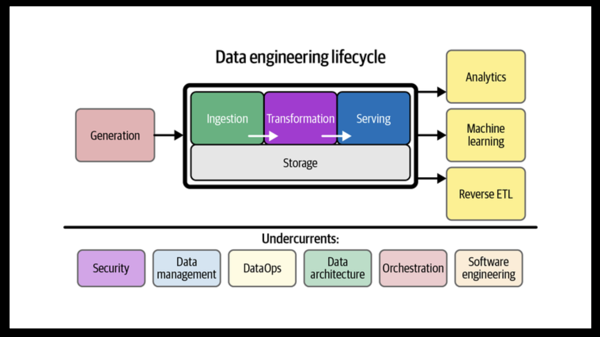
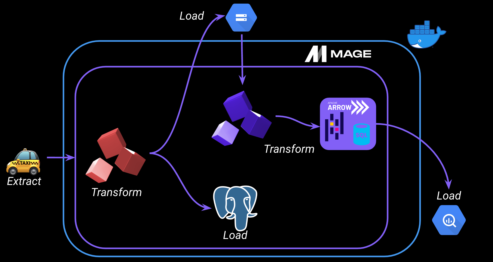
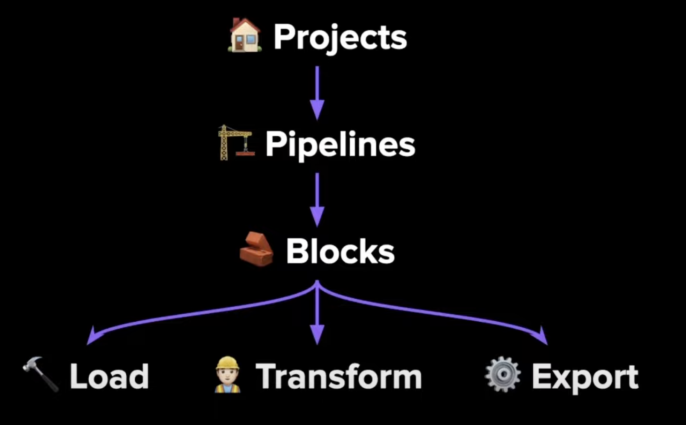

# Week 2: Workflow orchestration with Mage

Mage is an open-source, hybrid framework for transforming and integrating data.

## 1. Overview

a large part of data engineering is extracting, transforming, and loading data between data sources.

What is orchestration?
Data orchestration is the process of automating and coordinating the flow of data between systems, ensuring that data is collected, processed, and transferred efficiently and reliably.

A good orchestrator handles…
- Workflow management
- Automation
- Error handling 
- Recovery
- Monitoring, alerting
- Resource optimization
- Observability
- Debugging
- Compliance/Auditing

What is Mage?
An open-source pipeline tool for orchestrating, transforming, and integrating data 👷🏼‍♂️ 

